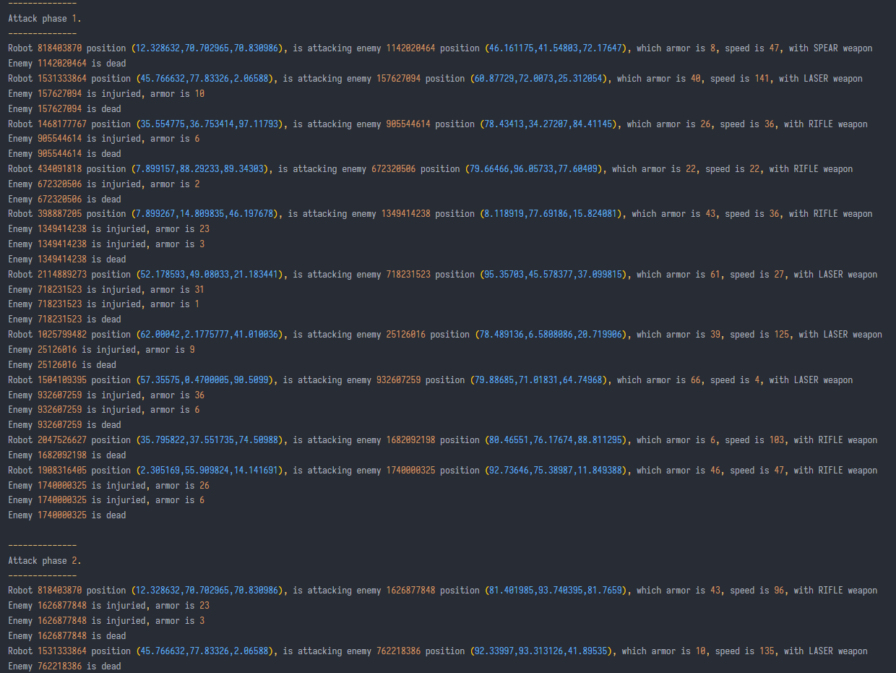

# Assignment 1 report

## Design of game

The aim of this game is that robots eliminate all enemies in the game map. There are three different `Color` of robots, `red`, `blue` and `green`. And three different kinds of weapons, which are `Laser`, `Rifile` and `Spear` could used by robots. These weapons have different damage to enemies. The enemy has two attributes, `armor` and `speed`. The enemy will apparent in the game map with the random position, random attributes. Both of robots and enemies have a `Position` attribute that represent the 3D position in the game map. Both of robots and enemies are producted in the `Factor`. When attacking, if enemies number is larger than robots, then attack will be divided into phases to complete eliminating all enemies.

And an important part of robot is `CommandCenter`. It will command all the robots in different ways to destroy the enemies. I design two ways in this project. The first is `DistanceBasedCommandMaker`, which robot eliminates the enemy closest to the itself first, and use the suitable weapon base on the enemies attributes (as the assignment require) from its `WeaponPack`. The `WeaponPack` has three different weapons in it. The second way is `UrgentCommandMaker`, it stand for the urgent state. Robots use the best weapon (laser) the protect the origin point, which is the base. They are two different strategy to destory enemies.

## Design pattern included the game

Base on the disign of this game, I use several design patterns to finish this project.

I use the _Strategy Pattern_ to make two different ways to command robots destory enemies. The two different ways extend a abstract class `CommandCenter`. In `Robot` class, `CommandCenter` will be used, when instant a robot, the specific type of `CommandCenter` will be used, `DistanceBasedCommandMaker` or `UrgentCommandMaker`. It can increace the flexibility of the code.

The _Singleton Pattern_ used in `DistanceBasedCommandMaker`, `UrgentCommandMaker` and `WeaponPack`. These classes do not change depending on the object used, i.e. different robots will use the same weapon pack and same command maker. Therefore, only one instance of these class is enough and private construcion method. Singleton pattern will reduce memory in runtime by avoiding creating many unnecessary instance.

The _Bridge Pattern_ used in `Factory`. `Factory` is the place to assemble robots and enemies. The `Color`, `WeaponPack` and `CommandCenter` attributes are parts of robot to assemble as instance.

Also, _Static Factor Pattern_ is the main idea of `Utils`. The `Utils` provides all static methods to help building the code. It do not need the member variables and construcion method. So, it has a private construcion method.

Apart from the above design pattern, these has some another little design pattern in code, I command it arround the code.

## UML

This is the UML of the project. The source file to make the image is at report/uml.drawio. This project includes 16 java files, contains `enum`, `interface` and `abstrct class`

## Test results

The following image is test 1 screenshot of stdout (`System.out`) of game. The complete information is at test directory. This test case create 10 robots and 12 enemies. Only two attacking phases in total. In this test case, all robots are using `DistanseBasedDecisionMaker`, which use the most suitable weapon. From the test case, the result is as same as specification requirements. 

There have other test case in test directory omitted for space reasons. 
